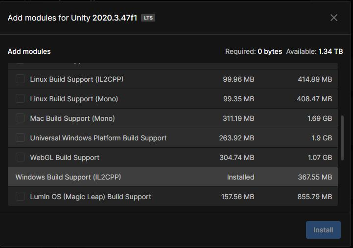
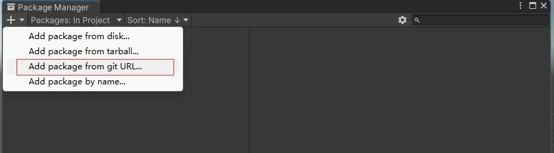

# 安装HybridCLR


## 安装兼容的Unity版本

安装 2019.4.x、2020.3.16+、2021.3.x 中任一版本。推荐安装2019.4.40、2020.3.26+、2021.3.x版本。

如果你的版本为 2019.4.0-2019.4.39、2020.3.16-2020.3.25，**需要先切换到2019.4.40和2020.3.33版本完成HybridCLR安装，再切换回当前版本**。

如果你不是经验丰富的Unity开发者，推荐先使用2021.3.1版本来体验HybridCLR。

根据你打包的目标平台，安装过程中选择必要模块。如果打包Android或iOS，直接选择相应模块即可。如果你想打包Standalone，必须额外选中 `Windows Build Support(IL2CPP)`或`Mac Build Support(IL2CPP)`。



## 安装IDE及相关工具

- Windows
  - Win下需要安装`visual studio 2019`或更高版本。安装时至少要包含 `使用Unity的游戏开发` 和 `使用c++的游戏开发` 组件。
  - 安装git
- Mac
  - 要求MacOS版本 >= 12，xcode版本 >= 13，例如`xcode 13.4.1， macos 12.4`。
  - 安装 git
  - 安装cmake


### 选择 `com.focus-creative-games.hybridclr_unity` 版本

当前 `v2.x.y` tag 和 `1.0`分支 系列都非常稳定。

`1.0`分支稳定运行很久，一些较早接入HybridCLR的项目在使用`1.0`分支版本。该分支已经停止维护。

main分支`v2.x.y`版本对工作流有较大改进，而且修复了一些`1.0`分支的bug。

**推荐新接入的项目使用`v2.x.y`系列版本**。

## 安装 com.focus-creative-games.hybridclr_unity package

hybridclr_unity 仓库地址为 [github](https://github.com/focus-creative-games/hybridclr_unity) ,国内快速的镜像仓库为[gitee](https://gitee.com/focus-creative-games/hybridclr_unity)。

有三种安装方式：

- 使用Package Manager从git url安装
- 使用Package Manager从openupm安装
- 本地安装

### 从git url安装

主菜单中点击`Windows/Package Manager`打开包管理器。如下图所示点击`Add package from git URL...`，填入`https://gitee.com/focus-creative-games/hybridclr_unity.git`或`https://github.com/focus-creative-games/hybridclr_unity.git`。


- main分支地址为 `https://gitee.com/focus-creative-games/hybridclr_unity.git`
- 1.0分支地址为 `https://gitee.com/focus-creative-games/hybridclr_unity.git#1.0`
- 其他tag版本地址为 `https://gitee.com/focus-creative-games/hybridclr_unity.git#{tag}`

想安装某个分支或者tag版本，请在地址后加上`#{tag}`，如 `https://gitee.com/focus-creative-games/hybridclr_unity.git#v2.4.1`。



不熟悉从url安装package的请看[install from giturl](https://docs.unity3d.com/Manual/upm-ui-giturl.html)。

### 从openupm安装

openump地址 [com.focus-creative-games.hybridclr_unity](https://openupm.com/packages/com.focus-creative-games.hybridclr_unity/)。

具体安装方式请打开该链接，查看页面中的详细安装说明。

### 从本地文件安装

将仓库clone到本地后，目录改名为com.focus-creative-games.hybridclr_unity，再直接移到项目的Packages目录即可。


## 初始化HybridCLR

为了减少package自身大小，有一些文件需要从Unity Editor的安装目录复制。因此安装完插件后，还需要一个额外的初始化过程。

点击菜单 `HybridCLR/Installer...`，弹出安装界面。在点击安装之前，可能需要一些设置。由于随着版本变化，Installer一直在调整，请根据你当前版本读取下面对应的说明。

### 如果你的版本 >= v2.0.5

hybridclr_unity中 `Data~/hybridclr_version.json` 文件中已经配置了当前package版本对应的兼容 hybridclr及il2cpp_plus的分支或者tag，
Installer会安装配置中指定的版本，不再支持自定义待安装的版本。

配置类似如下：

```json
{
    "versions": [
    {
        "unity_version":"2019",
        "hybridclr" : { "branch":"v2.0.1"},
        "il2cpp_plus": { "branch":"v2019-2.0.1"}
    },
    {
        "unity_version":"2020",
        "hybridclr" : { "branch":"v2.0.1"},
        "il2cpp_plus": { "branch":"v2020-2.0.1"}
    },
    {
        "unity_version":"2021",
        "hybridclr" : { "branch":"v2.0.1"},
        "il2cpp_plus": { "branch":"v2021-2.0.1"}
    }
    ]
}
```

如果你一定要安装其他版本的hybridclr或il2cpp_plus，修改该配置文件中的branch为目标分支或者tag。

绝大多数情况下，直接点击`安装`默认从远程仓库下载安装即可。安装成功后，控制台会打印`安装成功`日志。如下图所示。


从版本2.3.1起新增支持直接从本地自己制作的包含hybridclr的libil2cpp目录复制安装。如果你网络不好，或者没有安装git导致无法从仓库远程下载安装，则可以先将 [il2cpp_plus](https://github.com/focus-creative-games/il2cpp_plus)和[hybridclr](https://github.com/focus-creative-games/hybridclr)下载到本地后，再根据下面**安装原理**小节的文档，由这两个仓库合并出含hybridclr的libil2cpp目录，接着在`Installer`安装界面中启用`从本地复制libil2cpp`选项，选择你制作的libil2cpp目录，再点击`安装`执行安装。如下图所示。


### 如果你的版本 >= 1.1.20

hybridclr_unity中 `Data~/hybridclr_version.json` 文件中已经配置了当前package版本对应的兼容 hybridclr及il2cpp_plus的版本，
Installer会安装配置中指定的版本，不再支持自定义待安装的版本。

配置类似如下：

```json
{
    "versions": [
    {
        "unity_version":"2019",
        "hybridclr" : { "branch":"main", "hash":"531f98365eebce5d1390175be2b41c41e217d918"},
        "il2cpp_plus": { "branch":"2019-main", "hash":"ebe5190b0404d1857832bd1d52ebec7c3730a01d"}
    },
    {
        "unity_version":"2020",
        "hybridclr" : { "branch":"main", "hash":"531f98365eebce5d1390175be2b41c41e217d918"},
        "il2cpp_plus": { "branch":"2020-main", "hash":"c6cf54285381d0b03a58126e0d39b6e4d11937b7"}
    },
    {
        "unity_version":"2021",
        "hybridclr" : { "branch":"main", "hash":"531f98365eebce5d1390175be2b41c41e217d918"},
        "il2cpp_plus": { "branch":"2021-main", "hash":"99cd1cbbfc1f637460379e81c9a7776cd3e662ad"}
    }
    ]
}

```

如果你想安装其他版本的hybridclr或il2cpp_plus，修改该配置文件中的branch和hash即可。

直接点击`安装`完成安装。安装成功后，控制台会打印`安装成功`日志。

### 如果你的package版本 <= 1.1.19

填写你要安装的hybridclr和il2cpp_plus仓库的 commit id或branch或tag。如果hybridclr的版本号留空，则安装hybridclr仓库main分支的最新版本。
如果il2cpp_plus的版本号留空，则安装相应年度版本主分支（如2020-main）的最新版本。

**hybridclr_uniyt分支、hybridclr仓库的分支跟il2cpp_plus仓库分支必须匹配**。如果你hybridclr_unity使用了main分支，则hybridclr必须使用main分支，il2cpp_plus必须使用`{version}-main`，如果你hybridclr_unity使用了1.0分支， 则hybridclr必须使用`1.0`分支，il2cpp_plus必须使用`{version}-1.0`分支。 如果你使用了某个tag的版本，确保这个tag所属的分支匹配。

hybridclr仓库推荐填写`1.0`，即每次安装1.0分支的最新版本；il2cpp_plus仓库推荐填`{年度版本}-1.0`（如2020-1.0），即每次安装`{年度版本}-1.0`分支的最新版本。如图：


目前已经发布了1.0.1稳定正式版本，同样推荐追求稳定的项目使用。hybridclr_unity取 `1.0.1-release`，hybridclr 版本取 `1.0.1-release`，il2cpp_plus版本取 `{version}-1.0.1-relase`。

完成以上设置后，点击`install`按钮完成安装。安装成功后，控制台会打印`安装成功`日志。

由于安装过程需要拉取hybridclr及il2cpp_plus仓库，有可能会因为网络故障而失败，如果
发现失败时 `HybridCLRData/hybridclr_repo`或`HybridCLRData/il2cpp_plus_repo`为空，请再次尝试。

最常见失败原因为git未安装，或者安装git后未重启UnityEditor和UnityHub。如果你确信安装了git，cmd中也确实能运行git，则尝试重启电脑。

如果因为各种特殊原因未能完成自动化安装，请参照下面的**安装原理**手动模拟整个安装过程。

## 安装后的特殊处理

### WebGL平台

由于Unity自身原因，WebGL平台必须全局安装。 请查阅下面章节的`全局安装`文档。


### Unity 2021

注意！**如果你的hybridclr_unity版本 >= v2.0.1**，由于已经使用MonoHook技术在不修改UnityEditor.CoreModule.dll的情况下也能复制出裁判后的AOT dll，**不需要**执行以下操作。

补充元数据及`HybridCLR/Generate/*`下的部分命令依赖裁减后的AOT dll。但Unity 2021版本（2019、2020不需要）打包`iOS平台`(其他平台不需要)时，由于Unity Editor未提供公开接口可以复制出target为iOS时的裁剪后的AOT dll，故必须使用修改后的UnityEditor.CoreModule.dll覆盖Unity自带的相应文件。

具体操作为将 `{package目录}/Data~/ModifiedUnityAssemblies/2021.3.x/UnityEditor.CoreModule-{Win,Mac}.dll` 覆盖 `{Editor安装目录}/Editor/Data/Managed/UnityEngine/UnityEditor.CoreModule.dll`，具体相关目录有可能因为操作系统或者Unity版本而有不同。

**由于权限问题，该操作无法自动完成，需要你手动执行复制操作。**

`UnityEditor.CoreModule.dll` 每个Unity小版本都不相同，我们目前暂时只提供了2021.3.1版本，如需其他版本请自己手动制作，详情请见 [修改Unity编辑器相关dll](/advanced/modifyunitydll.md)。

### Unity 2019

为了支持2019，需要修改il2cpp生成的源码，因此我们修改了2019版本的il2cpp工具。故Installer的安装过程多了一个额外步骤：将 `{package}/Data~/ModifiedUnityAssemblies/2019.4.40/Unity.IL2CPP.dll` 复制到 `{project}/HybridCLRData/LocalIl2CppData/il2cpp/build/deploy/net471/Unity.IL2CPP.dll`

**注意，该操作在Installer安装时自动完成，不需要手动操作。**

对于使用2019.4.0-2019.4.39版本的开发者，请先切换到2019.4.40版本完成安装，再切回你当前版本。

## 在非兼容的Unity版本中使用HybridCLR

由于我们没有完全测试所有Unity版本，实际上一些不在支持列表中的Unity版本，也有可能能正常使用HybridCLR。安装方式如下：

- 找一个离你的版本最近的在支持列表中的版本，例如你的版本号为 2021.2.20,则离你最新的版本为2021.3.0。
- 先将你的Unity工程切换到这个最近的受支持的版本，安装HybridCLR。
- 切换回你的Unity版本。
- 尝试打包，如果能顺利运行，则表明HybridCLR支持你这个版本，如果有问题，那还是升级版本吧。

如果你一定要使用该版本，可以联系我们提供[商业技术支持](/other/business.md)。

## `HybridCLR/Installer`工作原理

本节只是介绍原理，**安装libil2cpp的操作已由installer完成，并不需要你手动操作**。

HybridCLR安装过程主要包含这几部分：

- 制作支持热更新的libil2cpp
- 本地或者全局安装，使新版本libil2cpp生效
- 对Unity Editor的少量改造

### 替换libil2cpp代码

原始的libil2cpp代码是AOT运行时，需要替换成改造后的libil2cpp才能支持热更新。改造后的libil2cpp由两部分构成

- il2cpp_plus
- hybridclr

il2cpp_plus仓库为对原始libil2cpp作了少量修改以支持动态**register**元数据的版本（改了几百行代码）。这个仓库与原始libil2cpp代码高度
相似。hybridclr为解释器部分的核心代码，包含元数据加载、代码transform(编译)、代码解释执行。

如下图所示，将`il2cpp_plus/libil2cpp`目录和`hybridclr/hybridclr`目录合并，制作出最终的支持热更新的libil2cpp。


### 本地安装

Unity允许使用环境变量`UNITY_IL2CPP_PATH`自定义`il2cpp`的位置，因此可以在项目本地创建il2cpp目录，用改造后的libil2cpp替换il2cpp目录下的libil2cpp目录，
再将`UNITY_IL2CPP_PATH`环境变量指向该目录。大致过程如下：

- 从Editor安装目录复制il2cpp目录到`{project}/HyridCLRData/LocalIl2CppData-{platform}/il2cpp`
- 从clone il2cpp_plus和hybridclr仓库，制作出最终的libil2cpp目录
- 将最终的libil2cpp目录替换 `{project}/HyridCLRData/LocalIl2CppData-{platform}/il2cpp/libil2cpp`
- 从Editor安装目录复制 `MonoBleedingEdge` 目录到 `{project}/HyridCLRData/LocalIl2CppData-{platform}/MonoBleedingEdge`
- 其他处理。如2019版本将 `{package}/Data~/ModifiedUnityAssemblies/2019.4.40/Unity.IL2CPP.dll` 复制到 `{project}/HybridCLRData/LocalIl2CppData/il2cpp/build/deploy/net471/Unity.IL2CPP.dll`


创建上层`LocalIl2CppData-{platform}`目录，而不是只创建il2cpp是因为实测发现仅仅指定il2cpp目录位置是不够的，打包时Unity隐含假设了il2cpp同级有一个`MonoBleedingEdge`目录，所以创建了上级目录，将il2cpp及MonoBleedingEdge目录都复制过来。

因为不同平台Editor自带的il2cpp目录略有不同，LocalIl2CppData要区分platform。

### 全局安装

全局安装需要替换（或链接）Editor安装目录的libil2cpp目录(Win下为{editor}/Data/il2cpp/libil2cpp，Mac类似)为改造后的libil2cpp，及额外替换一些修改的文件（如2019还需要修改Unity.IL2CPP.dll）。有几个缺陷：

- 因为目录权限原因，可能无法自动完成
- 会影响其他不使用hybridclr的项目
- `HybridCLR/Generate/xxxx`操作需要修改libil2cpp目录下的文件，有可能目录权限的原因而失败。

使用`HybridCLR/Installer`完成安装后，在`HybridCLR/Settings`中开启 `useGlobalIl2Cpp` 选项来启动全局安装，此时会清除环境变量`UNITY_IL2CPP_PATH`。

如果你使用替换目录的方式进行全局安装，并且你的hybridclr_unity版本 >= 2.1.0，则**第一次**覆盖libil2cpp前，请先运行`HybridCLR/Generate/Il2cppDef`（只此一次，后面不再需要，除非你切换了项目Unity版本）以生成正确的版本宏，再覆盖原始的libil2cpp目录。**符号链接安装方式或者hybridclr_unity版本低于2.1.0不需要执行此操作，直接覆盖原始的libil2cpp目录即可**。

由于权限原因，即使是全局安装，`Generate/xxx`命令修改的是本地`{project}/HyridCLRData/LocalIl2CppData-{platform}/il2cpp/libil2cpp`下的文件。**请每次generate后都将本地libil2cpp目录覆盖全局安装目录**。


每次替换libil2cpp目录非常麻烦，推荐使用链接安装目录的libil2cpp目录到本地libil2cpp目录方式。方法如下：
- Win平台。以管理员权限打开命令行窗口，删除或者重命名原libil2cpp，然后运行 `mklink /D  "<Editor安装目录的libil2cpp目录路径>" "{project}/HyridCLRData/LocalIl2CppData-{platform}/il2cpp/libil2cpp"`。
- Linux或者Mac平台。以管理员权限打开命令行窗口，删除或者重命名原libil2cpp，然后运行 `ln -s "{project}/HyridCLRData/LocalIl2CppData-{platform}/il2cpp/libil2cpp" "<Editor安装目录的libil2cpp目录路径>" `。

对于2019版本替换 Unity.IL2CPP.dll，也使用类似上面的替换或者软链接的方式。


## 注意事项

由于 Unity 的缓存机制，更新 HybridCLR 后，一定要清除 Library\Il2cppBuildCache 目录，不然打包时不会使用最新的代码。如果你使用Installer来自动安装或者更新HybridCLR，它会自动清除这些目录，不需要你额外操作。
