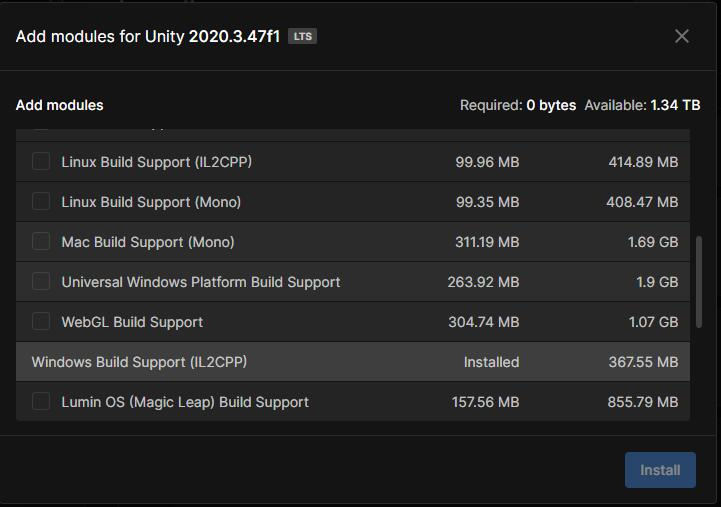
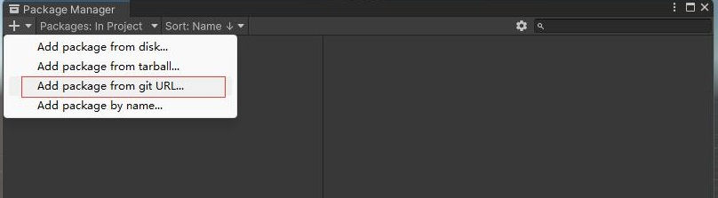
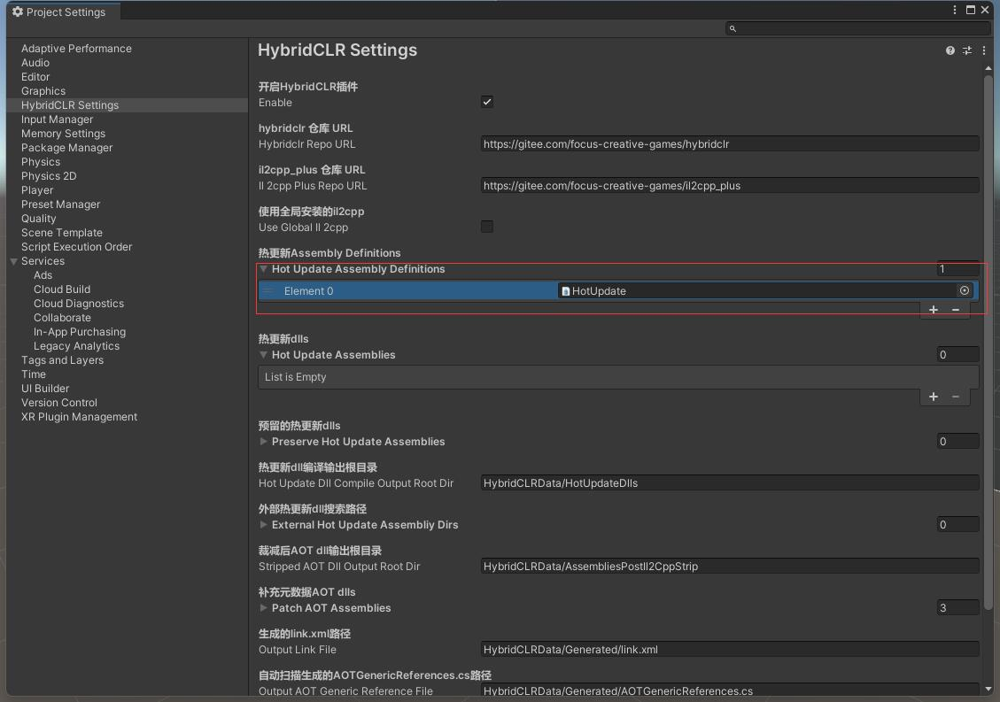
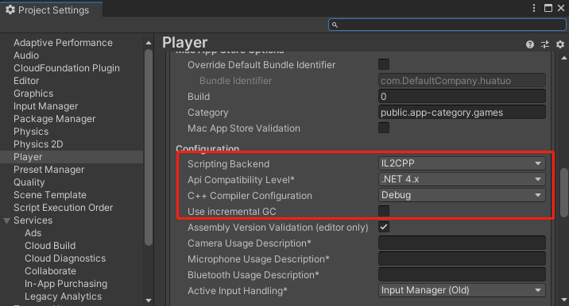

# 快速上手

本教程引导从空项目开始体验HybridCLR热更新。出于简化起见，只演示BuildTarget为**Windows**或**MacOS** Standalone平台的情况。

请在Standalone平台上正确跑通热更新流程后再自行尝试Android、iOS平台的热更新，它们的流程非常相似。

## 体验目标

- 创建热更新程序集
- 加载热更新程序集，并执行其中热更新代码，打印 `Hello, HybridCLR`
- 修改热更新代码，打印 `Hello, World`

## 准备环境

### 安装Unity

!> HybridCLR也支持2019.4.x，但新手请先按照下面要求跑通流程后，再根据[安装HybridCLR](/basic/install.md)文档尝试2019.4.x。

- 安装 2020.3.26+、 2021.3.0+、2022.3.0+ 中任一版本。如果你不是经验丰富的Unity开发者，推荐使用2021.3.1版本。
- 根据你所用的操作系统，安装过程中选择模块时，必须选中 `Windows Build Support(IL2CPP)`或`Mac Build Support(IL2CPP)`。



### 安装IDE及相关编译环境

- Windows
  - Win下需要安装`visual studio 2019`或更高版本。安装时至少要包含 `使用Unity的游戏开发` 和 `使用c++的游戏开发` 组件。
  - 安装git
- Mac
  - 要求MacOS版本 >= 12，xcode版本 >= 13，例如`xcode 13.4.1， macos 12.4`。
  - 安装 git
  - 安装cmake

## 初始化Unity热更新项目

从零开始构造热更新项目的过程较冗长，项目结构及资源及代码均可参考hybridclr_trial项目，其仓库地址为 [github](https://github.com/focus-creative-games/hybridclr_trial) 或 [gitee](https://gitee.com/focus-creative-games/hybridclr_trial)。

### 创建项目

创建空的Unity项目。

### 创建`ConsoleToScreen.cs`脚本

这个脚本对于演示热更新没有直接作用。它可以打印日志到屏幕上，方便定位错误。

创建 `Assets/ConsoleToScreen.cs` 脚本类，代码如下：

```csharp
using System;
using System.Collections;
using System.Collections.Generic;
using UnityEngine;

public class ConsoleToScreen : MonoBehaviour
{
    const int maxLines = 50;
    const int maxLineLength = 120;
    private string _logStr = "";

    private readonly List<string> _lines = new List<string>();

    public int fontSize = 15;

    void OnEnable() { Application.logMessageReceived += Log; }
    void OnDisable() { Application.logMessageReceived -= Log; }

    public void Log(string logString, string stackTrace, LogType type)
    {
        foreach (var line in logString.Split('\n'))
        {
            if (line.Length <= maxLineLength)
            {
                _lines.Add(line);
                continue;
            }
            var lineCount = line.Length / maxLineLength + 1;
            for (int i = 0; i < lineCount; i++)
            {
                if ((i + 1) * maxLineLength <= line.Length)
                {
                    _lines.Add(line.Substring(i * maxLineLength, maxLineLength));
                }
                else
                {
                    _lines.Add(line.Substring(i * maxLineLength, line.Length - i * maxLineLength));
                }
            }
        }
        if (_lines.Count > maxLines)
        {
            _lines.RemoveRange(0, _lines.Count - maxLines);
        }
        _logStr = string.Join("\n", _lines);
    }

    void OnGUI()
    {
        GUI.matrix = Matrix4x4.TRS(Vector3.zero, Quaternion.identity,
           new Vector3(Screen.width / 1200.0f, Screen.height / 800.0f, 1.0f));
        GUI.Label(new Rect(10, 10, 800, 370), _logStr, new GUIStyle() { fontSize = Math.Max(10, fontSize) });
    }
}


```

### 创建主场景

- 创建默认初始场景 main.scene
- 场景中创建一个空GameObject，将ConsoleToScreen挂到上面
- 在`Build Settings`中添加main场景到打包场景列表

### 创建 HotUpdate 热更新模块

- 创建 `Assets/HotUpdate` 目录
- 在目录下 右键 `Create/Assembly Definition`，创建一个名为`HotUpdate`的程序集模块

## 安装和配置HybridCLR

### 安装 `com.code-philosophy.hybridclr` 包

主菜单中点击`Windows/Package Manager`打开包管理器。如下图所示点击`Add package from git URL...`，填入`https://gitee.com/focus-creative-games/hybridclr_unity.git`或`https://github.com/focus-creative-games/hybridclr_unity.git`。



不熟悉从url安装package的请看[install from giturl](https://docs.unity3d.com/Manual/upm-ui-giturl.html)。

由于国内网络原因，在unity中可能遇到网络异常而无法安装。你可以先把 `com.code-philosophy.hybridclr` clone或者下载到本地，将文件夹改名为`com.code-philosophy.hybridclr`，直接移动到项目的`Packages`目录下即可。

### 初始化 `com.code-philosophy.hybridclr` 

打开菜单`HybridCLR/Installer...`， 点击`安装`按钮进行安装。 耐心等待30s左右，安装完成后会在最后打印 `安装成功`日志。

### 配置HybridCLR

打开菜单 `HybridCLR/Settings`， 在`Hot Update Assemblies`配置项中添加`HotUpdate`程序集，如下图：



### 配置PlayerSettings

- 关闭增量式GC(Use Incremental GC) 选项。因为目前不支持增量式GC。
- `Scripting Backend` 切换为 `IL2CPP`。
- `Api Compatability Level` 切换为 `.Net 4.x`(Unity 2019-2020) 或 `.Net Framework`（Unity 2021+）。



## 创建热更新脚本

创建 `Assets/HotUpdate/Hello.cs` 文件，代码内容如下

```csharp
using System.Collections;
using UnityEngine;

public class Hello
{
    public static void Run()
    {
        Debug.Log("Hello, HybridCLR");
    }
}
```

你可能会关心热更新部分的代码会不会像其他方案那样对C#语法有限制。HybridCLR是近乎完备的实现，对热更新代码几乎没有限制，放飞自我地写吧。

极少数的例外可以查看[不支持的特性](/basic/notsupportedfeatures.md)。

## 加载热更新程序集

为了简化演示，我们不通过http服务器下载HotUpdate.dll，而是直接将HotUpdate.dll放到StreamingAssets目录下。

HybridCLR是原生运行时实现，因此调用`Assembly Assembly.Load(byte[])`即可加载热更新程序集。

创建`Assets/LoadDll.cs`脚本，然后**在main场景中创建一个GameObject对象，挂载LoadDll脚本**。

```csharp
using HybridCLR;
using System;
using System.Collections;
using System.Collections.Generic;
using System.IO;
using System.Linq;
using System.Reflection;
using System.Threading.Tasks;
using UnityEngine;
using UnityEngine.Networking;

public class LoadDll : MonoBehaviour
{

    void Start()
    {
      // Editor环境下，HotUpdate.dll.bytes已经被自动加载，不需要加载，重复加载反而会出问题。
#if !UNITY_EDITOR
        Assembly hotUpdateAss = Assembly.Load(File.ReadAllBytes($"{Application.streamingAssetsPath}/HotUpdate.dll.bytes"));
#else
      // Editor下无需加载，直接查找获得HotUpdate程序集
        Assembly hotUpdateAss = System.AppDomain.CurrentDomain.GetAssemblies().First(a => a.GetName().Name == "HotUpdate");
#endif
    }
}

```


## 调用热更新代码

显然，主工程不能直接引用热更新代码。有多种方式可以从主工程调用热更新程序集中的代码，这里通过反射来调用热更新代码。

在`LoadDll.Start`函数后面添加反射调用代码，最终代码如下：

```csharp
    void Start()
    {
      // Editor环境下，HotUpdate.dll.bytes已经被自动加载，不需要加载，重复加载反而会出问题。
#if !UNITY_EDITOR
        Assembly hotUpdateAss = Assembly.Load(File.ReadAllBytes($"{Application.streamingAssetsPath}/HotUpdate.dll.bytes"));
#else
      // Editor下无需加载，直接查找获得HotUpdate程序集
        Assembly hotUpdateAss = System.AppDomain.CurrentDomain.GetAssemblies().First(a => a.GetName().Name == "HotUpdate");
#endif
    
        Type type = hotUpdateAss.GetType("Hello");
        type.GetMethod("Run").Invoke(null, null);
    }

```

至此，完成整个热更新工程的创建工作！！！

## Editor中试运行

运行main场景，屏幕上会显示 'Hello,HybridCLR'，表示代码工作正常。

## 打包运行

- 运行菜单 `HybridCLR/Generate/All` 进行必要的生成操作。**这一步不可遗漏**!!!
- 将`{proj}/HybridCLRData/HotUpdateDlls/StandaloneWindows64(MacOS下为StandaloneMacXxx)`目录下的HotUpdate.dll复制到`Assets/StreamingAssets/HotUpdate.dll.bytes`，**注意**，要加`.bytes`后缀！！！
- 打开`Build Settings`对话框，点击`Build And Run`，打包并且运行热更新示例工程。

如果打包成功，并且屏幕上显示 'Hello,HybridCLR'，表示热更新代码被顺利执行！

## 测试热更新

- 修改`Assets/HotUpdate/Hello.cs`的Run函数中`Debug.Log("Hello, HybridCLR");`代码，改成`Debug.Log("Hello, World");`。
- 运行菜单命令`HybridCLR/CompileDll/ActiveBulidTarget`重新编译热更新代码。
- 将`{proj}/HybridCLRData/HotUpdateDlls/StandaloneWindows64(MacOS下为StandaloneMacXxx)`目录下的HotUpdate.dll复制为刚才的打包输出目录的 `XXX_Data/StreamingAssets/HotUpdate.dll.bytes`。
- 重新运行程序，会发现屏幕中显示`Hello, World`，表示热更新代码生效了！ 

至此完成热更新体验！！！
