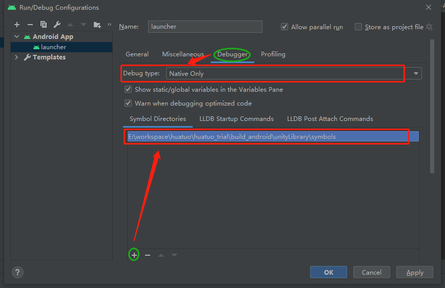

# HybridCLR source code structure and debugging

## HybridCLR module introduction

HybridCLR implements the following functions:

- dll parsing library implemented by c++
- Metadata registration. Since il2cpp is a static AOT, the original code does not support dynamic registration, because a small amount of modification (hundreds of lines)
- Instruction set conversion. Convert raw IL instructions into more efficient register instructions
- Register interpreter. Implemented an efficient interpreter.

In terms of directory structure, it corresponds to:

- HybridCLR's own source code
   - interpreter module
   - metadata metadata parsing and registration module
   - transform instruction set conversion module
- Minor modifications to il2cpp source code. HybridCLR mainly modifies the il2cpp source code to support dynamic registration of metadata. In most places, only hook processing is inserted, and the original implementation is not modified. For example:

```cpp
const char* il2cpp::vm::GlobalMetadata::GetStringFromIndex(StringIndex index)
{
     // ==={{ hybridclr
     if (hybridclr::metadata::IsInterpreterIndex(index))
     {
         return hybridclr::metadata::MetadataModule::GetStringFromEncodeIndex(index);
     }
     // ===}} hybridclr

     IL2CPP_ASSERT(index <= s_GlobalMetadataHeader->stringCount);
     const char* strings = ((const char*)s_GlobalMetadata + s_GlobalMetadataHeader->stringOffset) + index;
     return strings;
}
```

### Transform Implementation Introduction

?> The core code is the `HiTransform::Transform` function in `hybridclr/transform/Transform.cpp`.

Very similar to regular instruction tree analysis. divided into parts

- BasicBlock division. Divide the original IL instruction into multiple BasicBlocks, each BasicBlock does not contain any jump function. Doing so can be more efficient to avoid accidental merging of instructions across jump blocks
- Simulate the execution of all logical branches, including jumps and exception branches, and convert each IL instruction into a corresponding register instruction.
- Instruction optimization (to be done). Development is expected to begin next month. At that time, most instructions can get 100-300% performance improvement.

### Interpreter Implementation Introduction

?> The core code is in the `Interpreter::Execute` function in `hybridclr/interpreter/Interpreter_Execute.cpp`.

More directly, it is a huge switch statement that interprets and executes instructions.

## debug

The core work of the HybridCLR interpreter consists of two parts:

- Instruction set conversion. Convert stack-based IL instructions to register-based versions. HiTransform::Transform function in HybridCLR/transform/transform.cpp.
- Interpreted execution of register instructions. Interpreter::Execute function in HybridCLR/interpreter/interpreter_Execute.cpp.

As long as the breakpoints are to these two functions, it is easy to follow the entire process from the conversion of the IL function to the solution execution step by step.

### PC, MAC create debugging project

- `Project Settings` settings
   - Modify `C++ Compiler Configuration` to Debug.
- Check "Create VisualStudio Solution" in `Building Settings`.

After the Build is completed, a debuggable project will be generated. For more information, please refer to [Unity Official Documentation](https://docs.unity3d.com/2020.3/Documentation/Manual/windowsstore-debugging-il2cpp.html)

### Android create debug project

- `Project Settings` settings
   - Modify `C++ Compiler Configuration` to Debug.
- `Building Settings` check `Export Project`.
- After the build is complete, use Android Studio to open the project.
- Assuming that the packaging output path is build_android, select Build->Make Module 'build_android.unityLibrary' in Android Studio, compile unityLibrary, and wait for the compilation to complete
- Select `Run->Edit Configurations...` and set as shown below.


- Normal debugging is fine.
