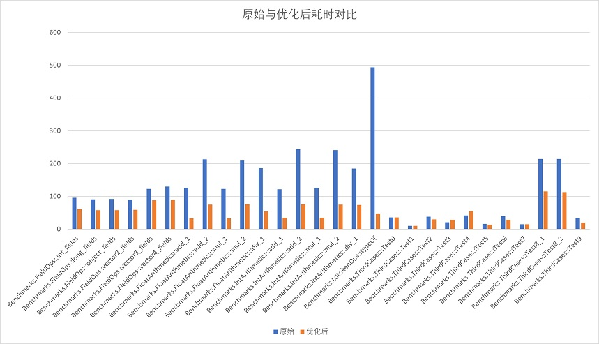
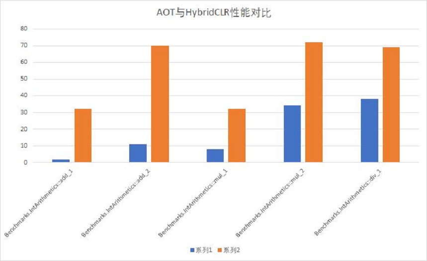

# 商业化服务

我们提供多种高端商业版本及可灵活定制的技术服务，满足游戏项目在各种应用场景下的需求。

请使用贵公司的**公司邮箱**向邮箱business@code-philosophy.com发起咨询，以QQ或者126邮箱之类发起的邮件会被忽略，敬请谅解。

## 旗舰版

?> 旗舰版本包含了我们独创的[`Differential Hybrid Execution(DHE)`](/en/advanced/differentialhybridexecution.md)技术，会智能地让变化或者新增的类和函数以interpreter模式运行，但未改动的类和函数以AOT方式运行，
业内**首次实现**了业务逻辑`任意变化`的同时，运行性能**达到原生AOT的水平**，是大型或性能要求严苛的项目的最佳选择。

旗舰版本当前已被商业项目线上验证过，达到了较高的稳定性水平，可以放心使用。

旗舰版的优势：

- 包含独创的`DHE`技术，未变化部分代码性能与原生完全相同，相较社区版本纯解释方式提升惊人的**3-30**倍甚至更高，整体**几乎达到**原生性能水平。
- **高级解释指令优化**，支持函数inline（对于短函数有10多倍的性能提升）、newobj inline、类成员访问优化、typeof优化、**数值指令**优化等重要优化。最为核心的数值指令性能提升100-300%，让解释器模块执行重度数值计算成为可能。
- 更敏捷的维护支持，随时获得最新的代码（社区版本出于维护成本考虑，只会定期发布版本）。
- 原生代码已全部在包体中，被各大AppStore拒审的风险大幅降低。
- 附含一年的技术支持，快速解决使用过程中遇到的各种问题。

以下是旗舰版本相比于社区版本的解释性能提升数据。注意，只有变化代码才会走解释，如果未改动，两者的性能和原生是一样的。

以下是数值计算方面原生与旗舰版本的解释性能对比，加法大约为7-16倍左右，乘法是4倍，除法是2倍。注意，只有变化代码才会走解释，如果未改动，性能和原生是一样的。

## HotReload特别版

HotReload特别版提供独创的`热重载技术`的支持。可以运行中完全卸载或者重新加载一个assembly，尤其适用于小游戏合集类型的游戏。

版本优势：

- 支持卸载单独的assembly，卸载大部分内存（预计95%以上），但有少量残留（如`[ThreadStatic]`标记的线程静态成员字段占据的内存）
- 支持重新加载assembly，代码基本可以任意变化甚至完全不同（除MonoBehaviour类外）。MonoBehaviour及ScriptableObject的热重载。
- 更敏捷的维护支持，随时获得最新的代码（社区版本出于维护成本考虑，只会定期发布版本）。

## WebGL 增强版

相对于社区版本对WebGL支持更稳定和完善，并提供了一些社区版本所不支持的高级特性，**性价比极高**。

版本优势：

- **对WebGL支持更完善**。
- 更敏捷的维护支持，随时获得最新的代码（社区版本出于维护成本考虑，只会定期发布版本）。

## 企业技术支持

可以灵活选择企业所需要的技术服务项目，如果按年订阅则根据服务项计费，否则根据服务时长计费。

- 对Android64、iOS64平台的技术支持（其他服务均只针对这些平台）
- 对Android32、**WebGL（含MiniGame、微信小游戏）**、Win64、MacOS平台的技术支持
- 移植对Linux、Switch等未支持平台的支持
- Bug标准响应及解决，包含一对一远程协助指导，大多数可复现bug会在2-7天内修复或者提供规避方案
- 对2019.4.x、2020.3.x等已经过期的LTS版本的bug修复支持
- 移植非标准支持范围内小版本的技术指导，例如指导支持2022.2.4版本。
- **提前获得Unity 2022、2023系列预览版本的支持**
- 提前获得社区版本暂未跟进的LTS小版本的支持
- 对.net standard 2.0及2.1的支持
- 对增量式GC的支持
- 优化指导
- 其他特殊的定制服务

## 联系方式

