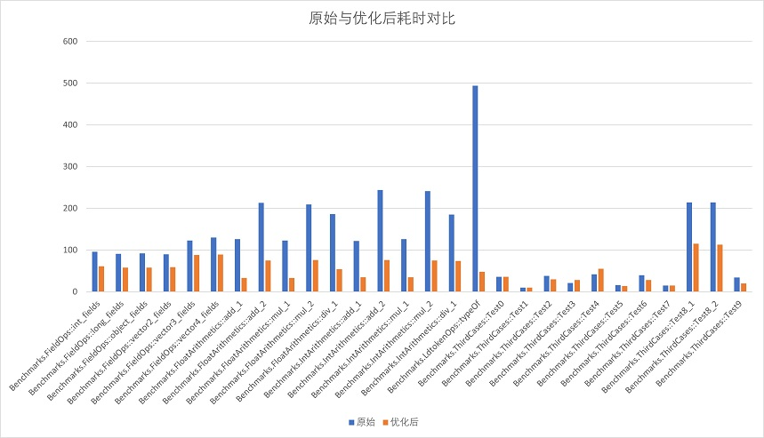

# 商业化服务

我们提供多种高端商业版本及可灵活定制的技术服务，满足游戏项目的各种应用场景下的需求。

## HybridCLR企业版

提供了一些社区版本所不支持的高级特性。

- **对WebGL支持更完善**。
- **优化了解释性能**，支持函数inline（对于短函数有10多倍的性能提升）、newobj inline、类成员访问优化、typeof优化等重要优化。
- 对2019.4.x、2020.3.x等已经到期的LTS版本的维护支持（出于维护成本的原因，社区2.x版本将停止更新，从3.x起，只维护2021、2022及更高版本）。
- 对Profile支持更佳，支持Memory Profile的内存快照，支持Profile.BeginSample和EndSample。

## Differential Hybrid Execution（DHE） 差分混合执行技术

Differential Hybrid Execution 使得开发者可以对AOT dll任意增删改，会智能地让变化或者新增的类和函数以interpreter模式运行，但未改动的类和函数以AOT方式运行，让热更新的游戏逻辑的运行性能基本达到原生AOT的水平。

DHE分区`标准`和`高级版本`，其中高级版本额外包含了`解释指令优化`。

### 特性与优势

- 未变化部分代码性能与原生完全相同，相较纯解释版本提升惊人的**3-30**倍甚至更高，整体几乎达到原生性能水平。
- 可以任意变更代码，对代码基本无入侵，几乎没有特殊注意事项，使用方式跟社区版本近似。
- 工作流简单，不需要像injectfix之类的方案那样自己标注哪些函数发生变化，由工具全部自动处理。
- 对项目的改造成本比纯热更新版本更低。例如可以直接在DHE中定义extern函数，而不需要移到AOT模块。
- 高级版本包含了**解释指令优化，变化部分的大多数数值计算指令性能提升100-300%甚至更多**（企业版本不含此项优化），进一步大幅提升性能水平。
- 原生代码已全部在包体中，被iOS拒审的风险大幅降低

以下是高级版本相比于标准版本的解释性能提升数据。注意，只有变化代码才会走解释，如果未改动，两者的性能和原生是一样的。

以下是数值计算方面AOT与高级版本的解释性能对比，加法大约是7-16倍左右，乘法是4倍，除法是2倍。注意，只有变化代码才会走解释，如果未改动，性能和原生是一样的。

### 未支持特性

- 加载DHE热更新代码前不能执行DHE对应的AOT assembly中的任何代码。意味着DHE不支持像mscorlib这种基础库的差分混合，但支持传统热更新assembly的差分热更新。
- 由于第一条的限制，不支持在DHE程序集中使用`[InitializeOnLoadMethod]`、`Script Execution Order settings`。
- 不支持DHE脚本挂载在随包资源中，包括Resources。（这条限制将来会放松或者去掉）
- 不能在DHE程序集中通过热更新新增extern函数。

## HotReload热重载技术

### 支持的特性

- 支持卸载assembly
- 支持重新加载assembly，代码基本可以任意变化甚至完全不同（除MonoBehaviour类外）
- 卸载大部分内存（预计95%以上），但有少量残留（如`[ThreadStatic]`标记的线程静态成员字段占据的内存）
- 支持MonoBehaviour及ScriptableObject的热重载。

### 不支持特性及特殊要求

- 要求业务代码不会再使用被卸载的Assembly中的对象或者函数，并且退出所有在执行的旧逻辑
- 要求重载后在旧Assembly中存在同名类的MonoBehaviour中的被Unity引擎特殊处理函数如Awake之类不发生增删（但函数体可以变化）

## 企业技术支持

可以灵活选择企业所需要的技术服务项目，根据服务项目计费。

- 对Android64、iOS64平台的技术支持（其他服务均只针对这些平台）
- 对Android32、**WebGL（含MiniGame、微信小游戏）**、Win64、MacOS平台的技术支持
- 移植对Linux、Switch等未支持平台的支持
- Bug标准响应及解决，包含一对一远程协助指导，大多数可复现bug会在2-7天内修复或者提供规避方案
- 对2019.4.x、2020.3.x等已经过期的LTS版本的bug修复支持
- 移植非标准支持范围内小版本的技术指导，例如指导支持2022.2.4版本。
- **提前获得Unity 2022、2023系列预览版本的支持**
- 提前获得社区版本暂未跟进的LTS小版本的支持
- 对.net standard 2.0及2.1的支持
- 对增量式GC的支持
- 优化指导
- 其他特殊的定制服务

## 联系方式

请使用贵公司的**公司邮箱**向邮箱business@code-philosophy.com发起咨询，以QQ或者126邮箱之类发起的邮件会被忽略，敬请谅解。

